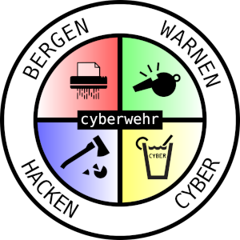
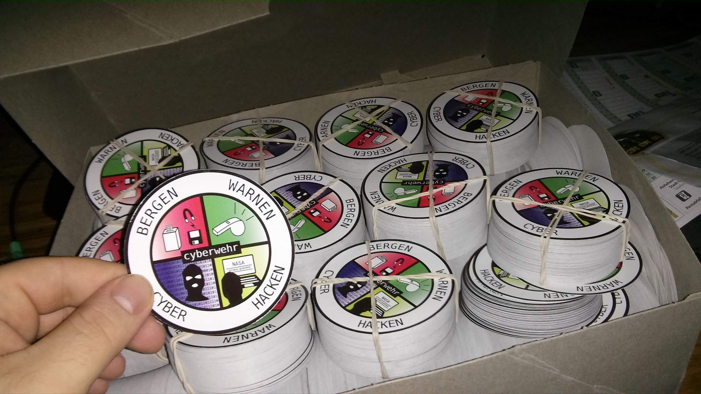

# cyberwehr-aufkleber

Fiktives Cyberwehr-Logo angelehnt an das der Freiwilligen Feuerwehr

## Die Cyberwehr

Das BSI [plant die Einrichtung einer „Cyberwehr“](https://netzpolitik.org/2016/tatue-tata-cyberwehr-fuer-hilfe-bei-it-sicherheitsvorfaellen-geplant-unternehmen-sollen-kostenlos-mitmachen/), die zur Hilfe eilen soll, wenn es im Bundestag mal wieder gecybert hat. Obige Grafik entstand, um sich ein wenig über diese absurde Idee mit einem noch absurderem Namen lustig zu machen.

## Der Aufkleber

Die Grafik wurde komplett in Inkscape selbst gezeichnet (wie man sieht), und es wurden keine fertigen Grafiken dafür verwendet.

Die Vektor-Grafik ist in zwei Ausführungen vorhanden: Einmal ist der Text als Text enthalten (damit dieser verändert werden kann), und in der anderen Version wurde der Text zu Kurven umgewandelt.
Die verwendete Schriftart ist [Hack](https://sourcefoundry.org/hack/), eine meiner Lieblingsschriften, besonders für Quellcode. Das [Hack Git-Repository](https://github.com/chrissimpkins/Hack) ist als Submodul enthalten. Bitte beachtet, dass dieser Font einer anderen Lizenz unterliegt, als diese Grafik! Die Lizenz liegt der Schriftart bei.

Unzufrieden mit dem „Artwork“? Mache einfach deine eigene, verbesserte Version des Aufklebers!

## Selber drucken

Keinen Aufkleber auf dem 33c3 bekommen? Die Grafiken zum Nachdrucken liegen dem Repository bei!

Sowohl eine svg-Datei mit ausreichend Beschnittrand und Toleranz ist vorhanden, sowie eine druckfertige 300dpi-JPEG-Datei im CMYK-Farbprofil mit 7cm Durchmesser. Dieses habe ich, so wie es dort liegt, bei [disyouth.net](disyouth.net) drucken lassen—das könnt Ihr auch tun. Oder Ihr geht einfach zum Aufkleber-Drucker Eurer Wahl.

